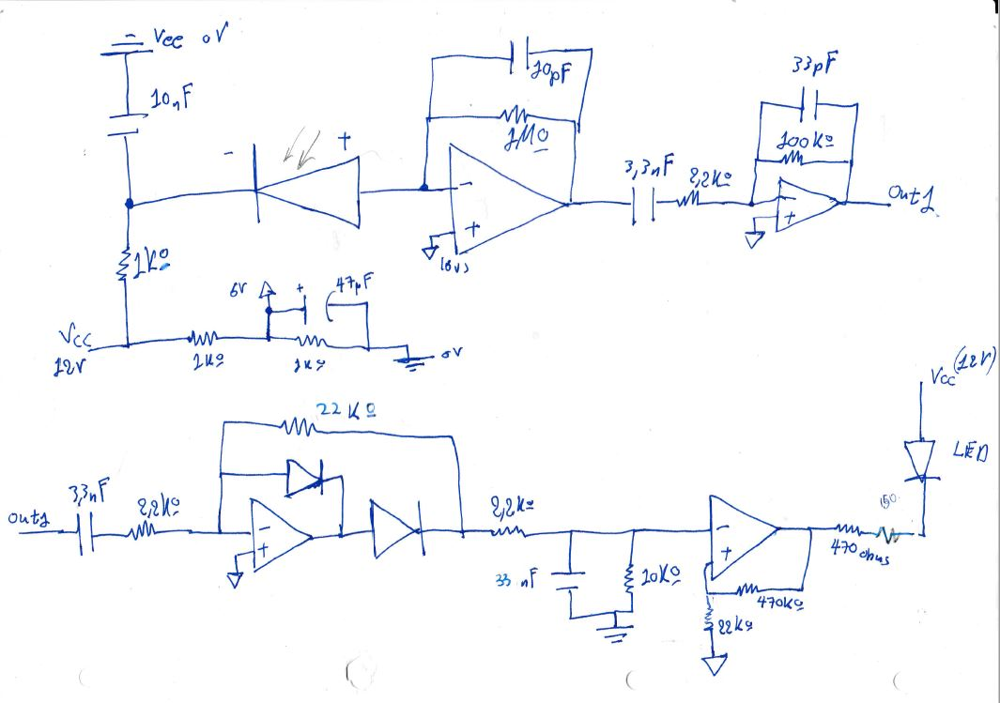

# Prototype-IR-Signal-Receiver-and-Decoder
Design and assembly , with a lab partner , of a TV-like signal receiver.

### General Description-What it does
   The end result was a signal receiver capable of accurately decoding signals of (IR) remote controls (31kHz nominal frequency) to distances of up to about 3 metres.The implementation was done on a prototype circuit board.It was designed on paper, tested via pc simulations and lab equipment.
   
### Why this project 
  This project was not focused on a specific application and it was done for a lab project in ECE NTUA engineering school.However, emphasis was put on the concepts of driving photodiode signal,filtering, amplifying and decoding that signal to finally deliver a specific output current on a "crucial device" (simulated as led current).
  
### What this project DID NOT focus on
 > * Perfectly smoothing photodiode signal and figuring out spcific nominal angles for electron excitation.
 > * Strictly filtering input signal around 31Khz. This means, frequencies close enough to 31Khz will still pass.
 > * Having perfect smoothing and expected wave forms in every stage.(Oscillations are possible but do not affect the project goal).Only cared about final stage current output.
 
### Limitations 
   * We had to use only one op-amp and TL-074 was the only available in the lab.
   * We only had specific value components in the lab.
   * Diodes available were 1N47 and 1N53 ,which work simillar.

##  Design Process

## Final Design
## Here's a look of the Final Design , so you can have a reference at what is described below

#### First Steps

   * First Stage: Theoretically , we gain a signal of 20 mV pp when photodiode is excited. Practically we have to smoothen this signal, drive it through an op-amp and then we have something measurable. The smoothening part of the first stage is a simple RC component with t >> rise and fall time of diode (100 ns). After measuring the output though at  typical distances we can even see we gain around 60mV pp.
   * Okay now, considering we need 12 volt power line for the op-amp, we set the virtual ground to 6 V (simple voltage divider).
   * Considering above point, we can "guess" we'll need a comparator with a threshold around 6 V. to decode the input signal "pulses". That means 6 volts/30mV= 200 total gain is needed.Of course, higher gain is also possible, but too high of a gain would result in photodiode "dark current" triggering the threshold.
   * Second Stage: Moving on, let's filter and amplify the signal. We tried to make a bandpass filter around 31 kHz. Reality is,because we did not really care that much that our device operates on exactly 31kHZ, no matter how bad we made this stage, we could always fix the gain in the later stages.
   * Third Stage: After managing to get around 30.5 gain in the filtering stage,using a classic half wave rectifier with op amp we can amplify the signal a bit more, around 8.5 times.
   ##### Important point 1 : Other light sources
   * Photodiode could also be excited by other light sources. To avoid any sudden "bursts" of voltage that will trigger our comparator, we can cut the gain a little bit with a voltage divider and get the 0.83 of the final value (10k,2.2k).
   ##### Important point 2 : Smoothing properly to achieve DC
   * Thus far, we have only achieved a half wave rectification.To make this a full DC signal we need a smoothing part which we can achieve with a simple RC. Because signal frequency (carrier) is 31kHz, T=0.03 ms , we want to achieve a time constant of at least 0.03 ms. At the same time, when the signal is "off", meaning in between tv remote signal pulses, we want the signal output to be off too. Thus, we must aim for a time constant **way smaller** than the 1/2 period of on-off (modulation signal). We can estimate the on-off frequency at around 30 Hz, because we can literally see the on-off pulses. (Led oscillates and it's perfectly normal).We can reach a satisfactory value of 0.073 ms by putting a 33 nf capacitor.
   ##### Important point 3 : LTSPICE 
   * When we simulate in LTSPICE, we might be tempted to measure the final point of our signal, right at the inverted input of the final op-amp comparator. This will yield wrong results, because, the RC circuit we used above for smoothing also acts as a Low Pass Filter. Spice takes this filtering into account, even though we have already achieved a relatively DC signal. The correct point of measurement and the result can be seen below.
  ### LT SPICE
  
  
  * Fourth Stage: Comparator: When we have signal high enough in the negative input the op amp is going to reach his low saturation point,0 volts ideally. Thus , knowing the output voltage and the virtual ground voltage we can set a voltage division to set the threshold at around 5.3 volts.
  
  * Final Stage: By estimating the LED drop voltage at around 1.5 Volts and considering we definitely have 0 volts at op amp output we can calculate the desired current (as close to 17 mA as possible) by placing proper value resistors.
  
  Final Comment: Cabling skills have significantly been improved since this project. 

