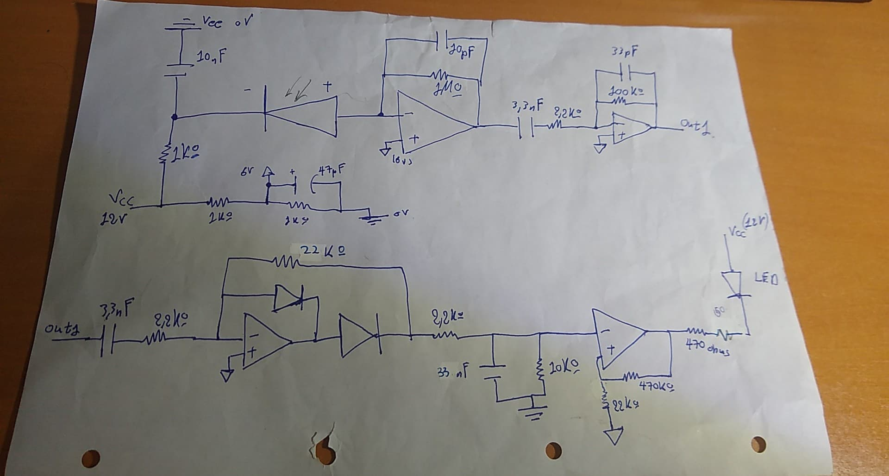

# Prototype-IR-Signal-Receiver-and-Decoder
Design and assembly , with a lab partner , of a TV-like signal receiver.

### General Description-What it does
   The end result was a signal receiver capable of accurately decoding signals of (IR) remote controls (31kHz nominal frequency) to distances of up to about 3 metres.The implementation was done on a prototype circuit board.It was designed on paper, tested via pc simulations and lab equipment.
   
### Why this project 
  This project was not focused on a specific application and it was done for a lab project in ECE NTUA engineering school.However, emphasis was put on the concepts of driving photodiode signal,filtering, amplifying and decoding that signal to finally deliver a specific output current on a "crucial device" (simulated as led current).
  
### What this project DID NOT focus on
 > * Perfectly smoothing photodiode signal and figuring out spcific nominal angles for electron excitation.
 > * Strictly filtering input signal around 31Khz. This means, frequencies close enough to 31Khz will still pass.
 > * Having perfect smoothing and expected wave forms in every stage.(Oscillations are possible but do not affect the project goal).Only cared about final stage current output.
 
### Limitations 
   * We had to use only one op-amp and TL-074 was the only available in the lab.
   * We only had specific value components in the lab.
   * Diodes available were 1N47 and 1N53 ,which work simillar.

##  Design Process

#### First Steps

   * First Stage: Theoretically , we gain a signal of 20 mV pp when photodiode is excited. Practically we have smoothen this signal, drive it through an op-amp and then we have something measurable. The smoothening part of the first stage is a simple RC component with t >> rise and fall time of diode (100 ns). After measuring the output though at a typical distance we can even see we gain around 60mV pp.
   * Okay now, considering we need 12 volt power line for the op-amp, we set the virtual ground to 6 V (simple voltage divider).
   * Considering above point, we can "guess" we'll need a comparator with a threshold around 6 V. to decode the input signal "pulses". That means 6 volts/30mV= 200 total gain is needed.Of course, higher gain is also possible, but too high of a gain would result in photodiode "dark current" triggering the threshold.
   * Okay, moving on, let's filter and amplify the signal. We tried to make a bandpass filter around 31 kHz. Reality is,because we did not really care that much that our device operates on exactly 31kHZ, no matter how bad we made this stage, we could always fix the gain in the later stages.
   * After managing to get around 30.5 gain in this filtering stage,using a classic half wave rectifying op amp 

## Final Design

